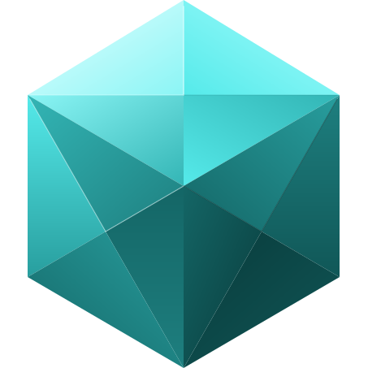
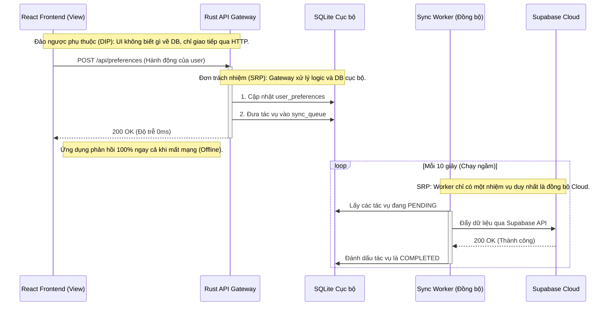

<div align="center">
  <picture>
    <source media="(prefers-color-scheme: dark)" srcset="./branch/logo_diamond_dark.svg">
    <source media="(prefers-color-scheme: light)" srcset="./branch/logo_diamond_light.svg">
    
  </picture>
  <h1>OmniDesk</h1>
  <p><strong>Hệ điều hành Doanh nghiệp & Không gian làm việc cho Lập trình viên (Local-First)</strong></p>
</div>

---

## 🌌 Tầm nhìn: Hệ điều hành Doanh nghiệp Local-First

OmniDesk không chỉ là một ứng dụng thông thường; nó là một **Micro-OS (Hệ điều hành siêu nhỏ)** được thiết kế dành cho các doanh nghiệp và nhà phát triển.

- **Launcher (Nhân hệ thống - Kernel):** Lõi của OmniDesk hoạt động như một kernel. Nó chịu trách nhiệm tuyệt đối về Xác thực (Authentication), Deep Links hệ thống (`omnidesk://`), Kết nối cơ sở dữ liệu (Local SQLite), Các dịch vụ chạy ngầm (Axum API Gateway), và Quản lý cửa sổ.
- **Các Ứng dụng (Userland):** Mọi thành phần khác—bao gồm Chợ ứng dụng (App Marketplace), các công cụ nội bộ, và plugin—đều là các "Ứng dụng" độc lập. Chúng tồn tại hoàn toàn cô lập và giao tiếp với hệ thống duy nhất thông qua Axum API Gateway nội bộ.

## 🧠 Triết lý Kiến trúc & Tuân thủ nguyên tắc SOLID

Để đảm bảo OmniDesk mở rộng một cách bảo mật và hiệu quả, chúng tôi tuân thủ 4 triết lý kiến trúc tối thượng được xây dựng xoay quanh các **Nguyên tắc SOLID**.

### 1. Cô lập Ứng dụng / Tính năng (Single Responsibility - Đơn trách nhiệm)
Mỗi ứng dụng bên trong OmniDesk được cô lập nghiêm ngặt trong thư mục `apps/` hoặc các package độc lập. Chúng không được phép import code trực tiếp của nhau. Mọi giao tiếp chéo giữa các ứng dụng bắt buộc phải đi qua Event Bus hoặc API Gateway của Launcher.

### 2. Backend là API Gateway thực sự (Dependency Inversion - Đảo ngược phụ thuộc)
React Frontend chỉ đóng vai trò là tầng hiển thị (View layer). **Quyền lực tuyệt đối thuộc về Rust Backend.**
Việc truy cập hệ thống file, gọi mạng, và các tác vụ nặng đều do Rust xử lý và cung cấp ra ngoài qua HTTP (`localhost:1421/api/...`). Frontend không bao giờ phụ thuộc trực tiếp vào cơ sở dữ liệu hay hệ điều hành.

### 3. Ưu tiên Local-First, Cloud là phụ (Hiệu năng & Khả năng phục hồi)
OmniDesk được xây dựng để đạt **độ trễ 0ms và khả năng hoạt động ngoại tuyến (offline) hoàn toàn**. Dữ liệu được ghi ngay lập tức vào cơ sở dữ liệu SQLite cục bộ. Cloud (Supabase) chỉ đóng vai trò là tầng đồng bộ hóa ngầm (background synchronization layer).

### 4. Zero-Trust với Web bên ngoài (Bảo mật)
**Không sử dụng WebView nội bộ cho các luồng xác thực hoặc nội dung bên ngoài.** Các luồng OAuth được định tuyến ra trình duyệt mặc định của hệ điều hành, sau đó hệ thống sẽ bắt lại payload một cách bảo mật thông qua Deep Links (`omnidesk://`).

---

## 🏗 Sơ đồ Tuần tự Hệ thống (SOLID)

Sơ đồ tuần tự dưới đây minh họa cách OmniDesk đáp ứng **Nguyên tắc Đảo ngược Phụ thuộc (DIP)** (bằng cách đặt một lớp trừu tượng HTTP giữa UI và DB) và **Nguyên tắc Đơn trách nhiệm (SRP)** (bằng cách tách biệt hoàn toàn UI, Core API và tiến trình Đồng bộ ngầm).



---

## 🛠 Công nghệ Sử dụng (Tech Stack)

- **Core/Backend:** Rust 🦀, Tauri v2, Axum (HTTP API Gateway), SQLx (SQLite Local DB)
- **Frontend:** React 19, TypeScript, Vite, TanStack Query v5
- **UI/UX:** Tailwind CSS v4, Shadcn/ui (Giao diện chuẩn doanh nghiệp)
- **Cloud/Sync:** Supabase (PostgreSQL, Auth, Edge Functions)

## 🚀 Hướng dẫn Cài đặt

### Yêu cầu hệ thống

- Node.js >= 20 & `pnpm`
- **Rust toolchain (target GNU)**:
  - Do cấu hình cargo yêu cầu target `x86_64-pc-windows-gnu` và linker `gcc`, lập trình viên Windows nên cài đặt Rust GNU Toolchain cùng GCC (MinGW).
  - Cách cài đặt nhanh qua Scoop:
    ```powershell
    scoop install rustup-gnu mingw
    rustup target add x86_64-pc-windows-gnu
    ```
    > [!IMPORTANT]
    > Sau khi chạy lệnh cài đặt qua Scoop trên Windows, bạn **bắt buộc phải khởi động lại VS Code** (hoặc Terminal đang dùng) để hệ thống nạp lại biến môi trường `PATH`. Nếu không, lệnh build sẽ báo lỗi `cargo metadata: program not found`.

### Các bước Cài đặt

```bash
# 1. Clone mã nguồn
git clone https://github.com/tuquet/omnidesk.git
cd omnidesk

# 2. Tạo file biến môi trường
cp .env.example .env

# 3. Cài đặt thư viện
pnpm install

# 4. Khởi chạy Local-First OS (Môi trường Phát triển)
pnpm --filter @omnidesk/desktop tauri dev
```

## 📖 Tài liệu Tham khảo
Các quy tắc phát triển và hướng dẫn kiến trúc chi tiết có thể được tìm thấy trong thư mục `.agents/AGENTS.md`.
