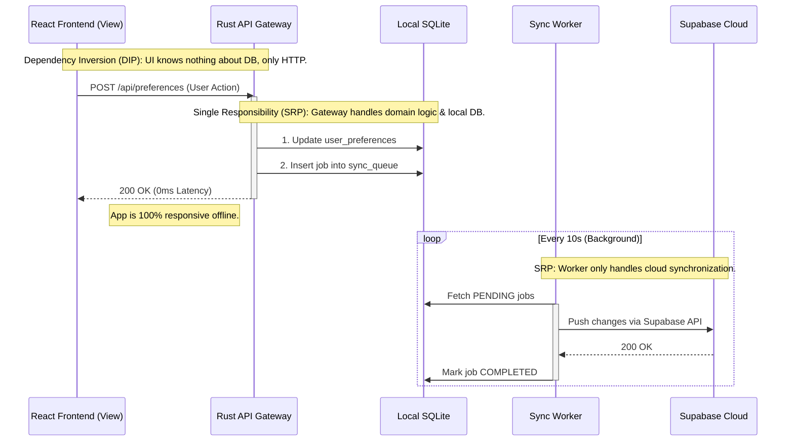

<div align="center">
  
  <h1>OmniDesk</h1>
  <p><strong>The Local-First Enterprise OS & Developer Workspace</strong></p>
</div>

---

## 🌌 Vision: The Local-First Enterprise OS

OmniDesk is not just a standard application; it is a **Micro-OS (Operating System)** designed for enterprises and developers.

- **The Launcher (Kernel):** OmniDesk's core acts as the kernel. It is strictly responsible for Authentication, System Deep Links (`omnidesk://`), Database Connections (Local SQLite), Background Services (Axum API Gateway), and Window Management.
- **The Apps (Userland):** Everything else—including the App Marketplace, internal tools, and plugins—are independent "Apps". They live in isolation and communicate with the system exclusively through the internal Axum API Gateway.

## 🧠 Architecture Philosophy & SOLID Compliance

To ensure OmniDesk scales securely and efficiently, we adhere to 4 extreme architectural philosophies built around **SOLID Principles**.

### 1. Micro-App / Feature Isolation (Single Responsibility)
Each app within OmniDesk is strictly isolated in `apps/` or standalone packages. They cannot directly import code from one another. All cross-app communication must route through the Launcher's Event Bus or API Gateway.

### 2. Backend is the Real API Gateway (Dependency Inversion)
The React Frontend is just a view layer. **Absolute power belongs to the Rust Backend.** 
File system access, network requests, and heavy lifting are handled by Rust and exposed via HTTP (`localhost:1421/api/...`). The frontend never depends directly on the database or the OS.

### 3. Local-First, Cloud-Second (Performance & Resilience)
OmniDesk is built for **0ms latency and full offline capability**. Data is immediately written to the local SQLite database. The Cloud (Supabase) acts only as a background synchronization layer.

### 4. Zero-Trust External Web (Security)
**No internal WebViews are used for external content or authentication.** OAuth flows route to the user's OS browser and securely catch payloads via Deep Links (`omnidesk://`).

---

## 🏗 System Sequence Architecture (SOLID)

The following sequence diagram demonstrates how OmniDesk satisfies the **Dependency Inversion Principle (DIP)** (by placing an HTTP abstraction between the UI and DB) and the **Single Responsibility Principle (SRP)** (by separating UI, Core API, and Background Sync processes).



---

## 🛠 Tech Stack

- **Core/Backend:** Rust 🦀, Tauri v2, Axum (HTTP API Gateway), SQLx (SQLite Local DB)
- **Frontend:** React 19, TypeScript, Vite, TanStack Query v5
- **UI/UX:** Tailwind CSS v4, Shadcn/ui (Strict Enterprise Aesthetics)
- **Cloud/Sync:** Supabase (PostgreSQL, Auth, Edge Functions)

## 🚀 Getting Started

### Prerequisites

- Node.js >= 20 & `pnpm`
- **Rust toolchain (GNU target)**:
  - Do cấu hình cargo yêu cầu target `x86_64-pc-windows-gnu` và linker `gcc`, lập trình viên Windows nên cài đặt Rust GNU Toolchain cùng GCC (MinGW).
  - Cách cài đặt nhanh qua Scoop:
    ```powershell
    scoop install rustup-gnu mingw
    rustup target add x86_64-pc-windows-gnu
    ```
    > [!IMPORTANT]
    > Sau khi chạy lệnh cài đặt qua Scoop trên Windows, bạn **bắt buộc phải khởi động lại VS Code** (hoặc Terminal) để hệ thống nạp lại biến môi trường `PATH`. Nếu không, lệnh build sẽ báo lỗi `cargo metadata: program not found`.

### Installation

```bash
# 1. Clone the repository
git clone https://github.com/tuquet/omnidesk.git
cd omnidesk

# 2. Cài đặt các file môi trường
cp .env.example .env

# 3. Install dependencies
pnpm install

# 4. Start the Local-First OS (Development)
pnpm --filter @omnidesk/desktop tauri dev
```

## 📖 Documentation
Detailed architectural guidelines and developer rules can be found in the `.agents/AGENTS.md` directory.
