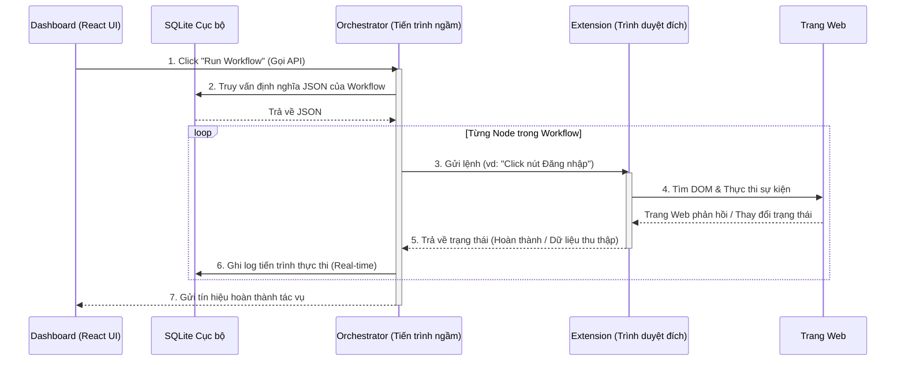

# 🤖 Automa

**Automa** là công cụ RPA (Robotic Process Automation - Tự động hóa quy trình bằng robot) và hệ thống thực thi luồng công việc (workflow) của hệ sinh thái OmniDesk.

Tuân thủ nghiêm ngặt triết lý **Cô lập Ứng dụng (Micro-App Isolation)** của OmniDesk, domain của Automa được module hóa mạnh mẽ thành 3 thành phần kiến trúc riêng biệt. Điều này đảm bảo sự tách biệt rõ ràng giữa việc thiết kế luồng công việc, quá trình thực thi ngầm, và việc tương tác trực tiếp với trình duyệt.

---

## 📂 Kiến trúc Thành phần

### 1. `dashboard` (Trung tâm Điều khiển)
Giao diện người dùng frontend, nơi người dùng có thể thiết kế, giám sát và quản lý các luồng tự động hóa.
*   **Vai trò**: Trình dựng workflow trực quan (kéo thả node), xem log, và bảng điều khiển tổng quan.
*   **Domain**: Thuộc tầng View. Nó không trực tiếp thực thi bất kỳ lệnh tự động hóa nào, mà chỉ gửi chỉ thị cho Orchestrator thông qua OmniDesk API Gateway.

### 2. `orchestrator` (Bộ não trung tâm)
Hệ thống thực thi chạy ngầm (background) chịu trách nhiệm quản lý toàn bộ vòng đời của tự động hóa.
*   **Vai trò**: Lên lịch tác vụ (scheduling), quản lý máy trạng thái (state machine), phân tích cú pháp workflow, và phân phối công việc.
*   **Domain**: Thuộc tầng Logic & Thực thi. Nó đọc các cấu hình workflow (từ SQLite cục bộ) và quyết định hành động nào sẽ được thực thi vào lúc nào.

### 3. `extension` (Đôi tay & Đôi mắt)
Một tiện ích mở rộng trình duyệt (Chrome/Edge) đóng vai trò làm cầu nối giữa Orchestrator và môi trường web đích.
*   **Vai trò**: Ghi lại hành động của người dùng (action recording), tương tác trực tiếp với DOM, cào dữ liệu (web scraping), và tiêm mã kịch bản (script injection).
*   **Domain**: Hoạt động hoàn toàn bên trong môi trường hộp cát (sandbox) của trình duyệt. Nó tiếp nhận lệnh từ Orchestrator, thực thi trên trang web, và trả kết quả về cho hệ thống.

---

## 🔄 Sơ đồ Tương tác Kiến trúc

Sơ đồ dưới đây thể hiện quy trình phối hợp hoạt động giữa 3 thành phần khi một quy trình tự động hóa được khởi chạy. Sơ đồ này chứng minh sự tách biệt trách nhiệm rõ ràng (Single Responsibility) giữa các component.

