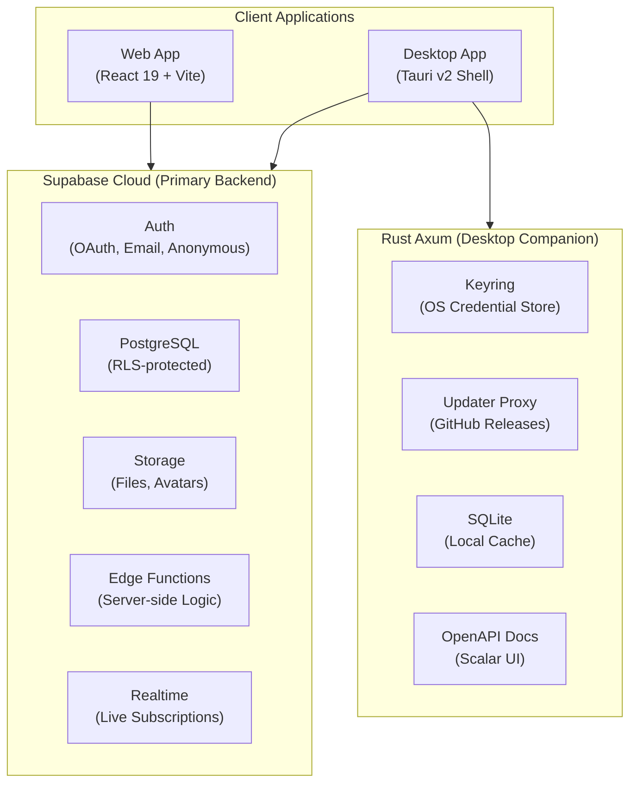

# Architecture

## Overview

Kill Bug Machine is a **Premium B2B Enterprise Platform** with an **App Marketplace**, built as a cross-platform monorepo. It delivers a modular workspace where users install only the features they need.

```
kill-bug-machine/
├── apps/
│   ├── desktop/        → Tauri v2 shell + Rust Axum companion API
│   └── web/            → React 19 + Vite 6 frontend
├── packages/
│   ├── config/         → Shared ESLint, TypeScript, Prettier configs
│   ├── types/          → Shared TypeScript type definitions & Zod schemas
│   └── ui/             → shadcn/ui component library (56+ components)
├── supabase/           → Supabase project (migrations, Edge Functions, config)
└── docs/               → VitePress documentation
```

## System Architecture



## Packages

### `apps/web`

The React frontend bundled by Vite. Uses:

- TanStack Router for file-based routing with lazy-loaded pages
- TanStack Query for server state (Supabase data)
- TanStack Store for client state (theme, dev mode, launcher)
- TanStack Form + Zod for type-safe form management
- shadcn/ui components from `@kbm/ui`
- Feature-based architecture under `src/features/`

### `apps/desktop`

The Tauri v2 desktop shell. Contains a Rust backend (`src-tauri/`) that:

- Wraps the web frontend in a native window (frameless, custom title bar)
- Runs a companion Axum HTTP server on port 1421 for desktop-only features
- Provides Tauri IPC commands for credential management (keyring)
- Handles app updates via `tauri-plugin-updater` (GitHub Releases)
- Supports deep linking via `kbm://` protocol (OAuth callback)
- Exposes OpenAPI documentation via Scalar at `/scalar`

### `supabase/`

The Supabase project directory. Contains:

- `config.toml` — local development configuration
- `migrations/` — SQL migration files for schema changes (planned)
- `functions/` — Edge Functions for server-side logic (planned)

### `packages/ui`

56+ shadcn/ui components pre-installed and ready to import:

```tsx
import { Button } from '@kbm/ui';
import { Sidebar, SidebarProvider } from '@kbm/ui';
```

The `cn()` utility is available for conditional class merging:

```tsx
import { cn } from '@kbm/ui';
```

### `packages/types`

Shared TypeScript type definitions and Zod schemas:

- `ApiResponse<T>` — standardized API response contract
- `ApiError` — error structure with i18n code mapping
- `ERROR_CODES` — centralized error code constants
- Common interfaces: `Person`, `Attachment`, `Comment`, `PaginationParams`

### `packages/config`

Shared configuration files for ESLint 9 (flat config), TypeScript 7 (strict mode with tsgo), and Prettier.

## Backend Strategy

| Layer | Technology | Scope |
|:------|:-----------|:------|
| **Primary Backend** | Supabase | Auth, Database (PostgreSQL + RLS), Storage, Edge Functions, Realtime |
| **Desktop Companion** | Rust Axum | OS keyring access, updater proxy, local SQLite cache, OpenAPI docs |

**Why two backends?**
- Supabase handles all cloud data and authentication — works identically on Web and Desktop.
- Axum handles desktop-specific OS integrations that require native access (credential storage, file system, system tray).

## App Marketplace Architecture

The platform uses a modular **App Marketplace** where each feature is a standalone "app":

| Concept | Implementation |
|:--------|:---------------|
| App Registry | `features/launcher/config/registry.ts` — app definitions (name, icon, category) |
| Installation State | `features/launcher/stores/use-launcher-store.ts` — TanStack Store + localStorage |
| Marketplace UI | `features/launcher/components/app-launcher.tsx` — install/uninstall grid |
| Dynamic Navigation | Sidebar items filtered by installed apps |
| Core Apps | Cannot be uninstalled (Dashboard, Team) |

## API

### Supabase (Primary)

All data operations use the Supabase client at `src/lib/supabase.ts`:

```typescript
import { supabase } from '@/lib/supabase';

// Auth
await supabase.auth.signInWithPassword({ email, password });
await supabase.auth.signInWithOAuth({ provider: 'github' });

// Data
const { data } = await supabase.from('marketplace_apps').select('*');
```

### Axum (Desktop Companion)

| Method | Path | Description |
|:-------|:-----|:------------|
| GET | `/` | Redirect to `/scalar` |
| GET | `/health` | Health check (returns JSON) |
| GET | `/ping` | Simple ping (returns "pong") |
| GET | `/scalar` | OpenAPI documentation UI |
| GET | `/updates/latest.json` | Local updater endpoint |

Add new routes in `apps/desktop/src-tauri/src/api/mod.rs`.
