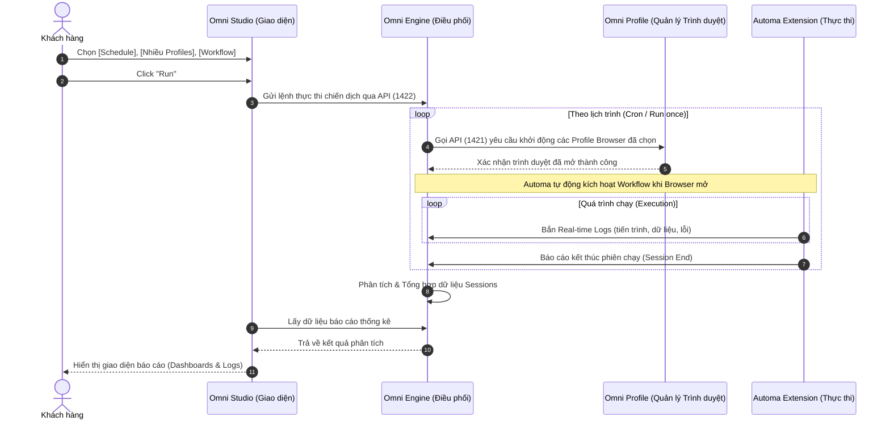

# Kiến trúc Nền tảng OmniDesk

Tài liệu này mô tả chi tiết về kiến trúc **Local-First** và luồng tương tác nghiệp vụ giữa các phân hệ cốt lõi của hệ sinh thái **OmniDesk**. Hệ thống được thiết kế nhằm tối ưu hóa trải nghiệm người dùng, đồng bộ dữ liệu theo thời gian thực và đảm bảo tiêu chuẩn bảo mật khắt khe nhất dành cho môi trường doanh nghiệp.

## 1. Tổng quan các Phân hệ Cốt lõi (Core Components)

| Phân hệ                            | Vai trò & Chức năng                                                                                                                                                                                           | Công nghệ nền tảng                 |
| :--------------------------------- | :------------------------------------------------------------------------------------------------------------------------------------------------------------------------------------------------------------ | :--------------------------------- |
| **Automa (Extension Designer)**    | Đóng vai trò là **Công cụ Thiết kế (Workflow Designer)** và thực thi trực tiếp bên trong trình duyệt. Cho phép thao tác kéo-thả trực quan, lưu trữ tạm thời tại IndexedDB và báo cáo Logs khi chạy.           | Browser Extension (MV3), IndexedDB |
| **Omni Studio (Dashboard)**        | Đóng vai trò là **Bảng Điều khiển (UI Dashboard)** và là **Nguồn dữ liệu gốc (Source of Truth)** tại máy trạm. Quản lý tập trung toàn bộ dữ liệu kịch bản tại cơ sở dữ liệu SQLite cục bộ, hiển thị thống kê. | React, Tauri, Rust, SQLite         |
| **Omni Profile (Browser Manager)** | Quản lý môi trường trình duyệt cách ly độc lập (Anti-detect browser). Đảm nhiệm việc tự động cài đặt Extension vào trình duyệt và cấp mới dữ liệu từ SQLite.                                                  | Tauri, Rust Backend, Playwright    |
| **Omni Engine (Orchestrator)**     | Đóng vai trò là **Nhạc trưởng điều phối (Execution Orchestrator)**. Quản lý việc đặt lịch (cronjob), điều phối API mở trình duyệt, kích hoạt Automa, thu thập và phân tích Logs các phiên chạy tự động.       | Rust Backend (Axum / Actix)        |
| **Supabase Cloud**                 | Cơ sở dữ liệu đám mây trung tâm phục vụ việc lưu trữ, chia sẻ và phân phối kịch bản (Marketplace). Quản lý hệ thống phân quyền và vai trò người dùng.                                                         | PostgreSQL, Edge Functions         |

### Danh mục API Khả dụng (OpenAPI & Scalar UI)

Để đảm bảo tính minh bạch và khả năng tích hợp linh hoạt cho đối tác, nền tảng OmniDesk cung cấp tài liệu API chuẩn OpenAPI cùng giao diện thử nghiệm Scalar UI tại các cổng (ports) độc lập:

- **Omni Profile API (Cổng 1421):** [http://localhost:1421/scalar](http://localhost:1421/scalar) (API quản lý trình duyệt)
- **Omni Engine API (Cổng 1422):** [http://localhost:1422/scalar](http://localhost:1422/scalar) (API điều phối, thu thập Logs, Schedule)
- **Omni Studio API (Cổng 1423):** [http://localhost:1423/scalar](http://localhost:1423/scalar) (API quản lý Workflow & Database)

---

## 2. Luồng Vận hành Nghiệp vụ (Business Logic Flow)

### 2.1. Luồng Thiết kế & Quản lý Kịch bản (Design & Sync Flow)

Kiến trúc **Local-First** của OmniDesk xử lý toàn bộ vòng đời của một kịch bản tự động hóa thông qua các bước khép kín:

1. **Thiết kế Kịch bản (Automa Extension):** Người dùng thao tác trên trình duyệt, sử dụng giao diện kéo-thả chuyên nghiệp của Automa để xây dựng luồng tự động hóa. Dữ liệu ban đầu được ghi nhận tại IndexedDB của Extension.
2. **Đồng bộ Dữ liệu (Automa -> Local SQLite):** Mã nguồn của Automa được tinh chỉnh để tự động giao tiếp qua giao thức API với backend. Dữ liệu được mã hóa và lưu trữ an toàn tại SQLite của ứng dụng Desktop.
3. **Đồng nhất Môi trường (SQLite -> Đa Trình duyệt):** Mỗi khi hệ thống khởi tạo một Profile trình duyệt mới, Automa tại Profile đó sẽ tự động truy xuất kịch bản mới nhất từ SQLite, đảm bảo tính đồng nhất trên hàng ngàn Profile.

### 2.2. Luồng Điều phối & Thực thi Tự động hóa (Execution Orchestration Flow)

**Omni Engine** đóng vai trò là "Nhạc trưởng" điều phối hoạt động giữa Omni Studio, Omni Profile và Automa. Việc chạy tự động một lệnh/kịch bản diễn ra như sau:

1. **Giao diện Thiết lập Chiến dịch (Omni Studio):** Trên giao diện Dashboard, người dùng cấu hình một chiến dịch bao gồm:
   - **Lên lịch trình (Schedule):** Chạy 1 lần (Run once) hoặc chạy định kỳ (Recurring/Cron).
   - **Chỉ định Trình duyệt:** Chọn 1 hoặc nhiều Profile Browser cùng lúc.
   - **Chỉ định Kịch bản:** Chọn 1 Workflow cụ thể để thực thi.
2. **Lệnh Thực thi (Studio -> Engine):** Khi người dùng nhấn nút **Run**, Omni Studio gửi toàn bộ payload cấu hình chiến dịch qua API cho Omni Engine (`Cổng 1422`).
3. **Điều phối Môi trường (Engine -> Profile):** Dựa trên lịch trình, Omni Engine tự động gọi các API của Omni Profile (`Cổng 1421`) để ra lệnh khởi chạy (launch) các cấu hình trình duyệt đã chọn.
4. **Thu thập Logs (Automa -> Engine):** Ngay khi trình duyệt mở, Automa được kích hoạt và bắt đầu chạy Workflow. Xuyên suốt quá trình chạy, Automa liên tục bắn Logs (trạng thái, lỗi) về cổng thu thập của Omni Engine.
5. **Phân tích & Thống kê (Engine -> Studio):** Omni Engine tổng hợp các phiên chạy (Sessions), phân tích kết quả và cung cấp dữ liệu (API) để Omni Studio hiển thị thành biểu đồ, bảng báo cáo phân tích trực quan cho người dùng.

---

## 3. Sơ đồ Kiến trúc Hệ thống

### Biểu đồ Tuần tự Thực thi (Execution Sequence Diagram)

---

## 4. Lợi thế Cạnh tranh (Unique Selling Points)

- **Kiến trúc Micro-App Rõ ràng:** Việc chia tách Omni Studio (UI), Omni Engine (Điều phối) và Omni Profile (Quản lý Trình duyệt) thành các dịch vụ độc lập giúp hệ thống chịu tải tốt, dễ dàng nâng cấp hoặc tích hợp API bên thứ 3.
- **Tối ưu hóa Chi phí (Cost Optimization):** Việc tích hợp sâu công cụ thiết kế của Automa giúp nền tảng cắt giảm đáng kể chi phí phát triển giao diện UI Workflow.
- **Trải nghiệm Local-First Xuyên suốt:** Mọi thao tác vận hành, lưu trữ dữ liệu và xử lý Logs nặng nề đều được giải quyết tức thời tại máy trạm cục bộ (SQLite). Hệ thống loại bỏ hoàn toàn độ trễ mạng internet.
- **Thống kê Thời gian thực:** Omni Engine đóng vai trò "cái phễu" hứng toàn bộ thông tin từ các tiến trình trình duyệt, mang đến cho người quản lý một cái nhìn tổng thể và tức thời về mọi chiến dịch tự động hóa.

---

## 5. Lộ trình Phát triển (Roadmap)

### Giai đoạn 1: Triển khai Nền tảng Local-First & Quản lý Trình duyệt

- [x] Tích hợp Automa Extension vào môi trường cách ly (Omni Profile).
- [x] Xây dựng cơ sở dữ liệu gốc (SQLite) và luồng đồng bộ kịch bản từ extension xuống máy trạm.

### Giai đoạn 2: Trình điều phối Thực thi & Phân tích (Execution Orchestrator)

- [ ] Xây dựng giao diện Điều phối (Orchestration UI) trên Omni Studio cho phép: **chọn Workflow, chọn 1 hoặc nhiều Profiles, thiết lập lịch chạy (One-time/Recurring) và nhấn "Run"**.
- [ ] Hoàn thiện **Omni Engine** làm nhiệm vụ điều phối API: gọi sang Omni Profile để tự động mở trình duyệt và đồng bộ với Automa.
- [ ] Xây dựng hệ thống thu thập Logs tập trung trên Omni Engine từ Automa truyền về.
- [ ] Xây dựng giao diện hiển thị báo cáo, phân tích các phiên chạy (Sessions) trên Omni Studio.

### Giai đoạn 3: Hệ sinh thái Đám mây & AI (Cloud Marketplace & AI-Driven)

- [ ] Tích hợp hệ thống phân quyền Supabase Auth, quản lý "Upload to Cloud" (kèm `author_id`).
- [ ] Tích hợp **AI Agent** để tự động tạo kịch bản từ ngôn ngữ tự nhiên (Prompt).
- [ ] Chuyển đổi OmniDesk thành một nền tảng tự động hóa Zero-Code toàn diện.
