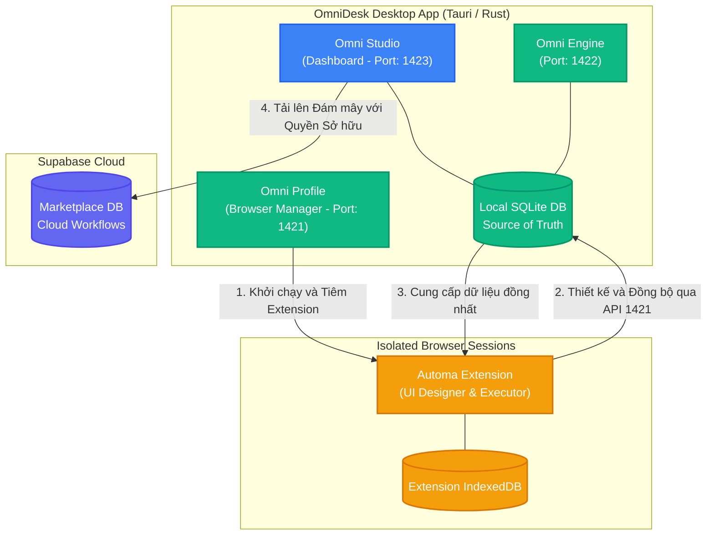
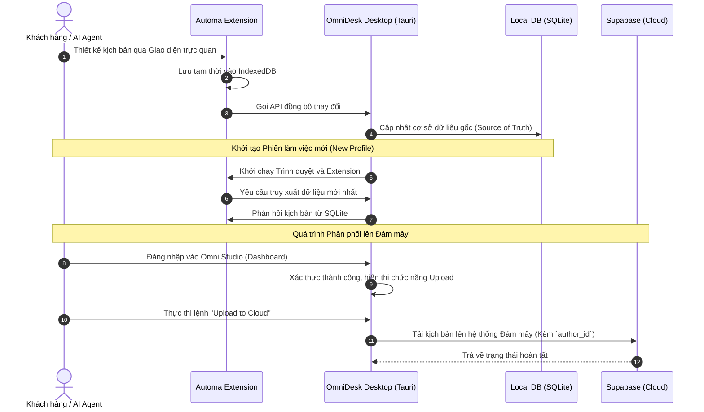

# Kiến trúc Nền tảng OmniDesk

Tài liệu này mô tả chi tiết về kiến trúc **Local-First** và luồng tương tác nghiệp vụ giữa các phân hệ cốt lõi của hệ sinh thái **OmniDesk**. Hệ thống được thiết kế nhằm tối ưu hóa trải nghiệm người dùng, đồng bộ dữ liệu theo thời gian thực và đảm bảo tiêu chuẩn bảo mật khắt khe nhất dành cho môi trường doanh nghiệp.

## 1. Tổng quan các Phân hệ Cốt lõi (Core Components)

| Phân hệ                         | Vai trò & Chức năng                                                                                                                                                                                           | Công nghệ nền tảng                 |
| :------------------------------ | :------------------------------------------------------------------------------------------------------------------------------------------------------------------------------------------------------------ | :--------------------------------- |
| **Automa (Extension Designer)** | Đóng vai trò là **Công cụ Thiết kế (Workflow Designer)** trực tiếp bên trong trình duyệt. Cho phép thao tác kéo-thả trực quan, lưu trữ tạm thời tại IndexedDB và tự động đồng bộ dữ liệu về ứng dụng Desktop. | Browser Extension (MV3), IndexedDB |
| **Studio & Local DB (Tauri)**   | Đóng vai trò là **Bảng Điều khiển (Dashboard)** và là **Nguồn dữ liệu gốc (Source of Truth)** tại máy trạm. Quản lý tập trung toàn bộ dữ liệu kịch bản tại cơ sở dữ liệu SQLite cục bộ.                       | React, Tauri, Rust, SQLite         |
| **Omni Profile**                | Quản lý môi trường trình duyệt cách ly độc lập (Anti-detect browser). Đảm nhiệm việc tự động cài đặt Extension vào trình duyệt và cấp mới dữ liệu từ SQLite.                                                  | Tauri, Rust Backend, Playwright    |
| **Supabase Cloud**              | Cơ sở dữ liệu đám mây trung tâm phục vụ việc lưu trữ, chia sẻ và phân phối kịch bản (Marketplace). Quản lý hệ thống phân quyền và vai trò người dùng.                                                         | PostgreSQL, Edge Functions         |

### Danh mục API Khả dụng (OpenAPI & Scalar UI)

Để đảm bảo tính minh bạch và khả năng tích hợp linh hoạt cho đối tác, nền tảng OmniDesk cung cấp tài liệu API chuẩn OpenAPI cùng giao diện thử nghiệm Scalar UI tại các cổng (ports) độc lập:

- **Omni Profile API (Cổng 1421):**
  - OpenAPI: [http://localhost:1421/openapi.json](http://localhost:1421/openapi.json)
  - Scalar UI: [http://localhost:1421/scalar](http://localhost:1421/scalar)

- **Omni Engine API (Cổng 1422):**
  - OpenAPI: [http://localhost:1422/openapi.json](http://localhost:1422/openapi.json)
  - Scalar UI: [http://localhost:1422/scalar](http://localhost:1422/scalar)

- **Omni Studio API (Cổng 1423):**
  - OpenAPI: [http://localhost:1423/openapi.json](http://localhost:1423/openapi.json)
  - Scalar UI: [http://localhost:1423/scalar](http://localhost:1423/scalar)

---

## 2. Luồng Vận hành Nghiệp vụ (Business Logic Flow)

Kiến trúc **Local-First** của OmniDesk xử lý toàn bộ vòng đời của một kịch bản tự động hóa thông qua 4 bước khép kín:

1. **Thiết kế Kịch bản (Automa Extension):** Người dùng thao tác trên trình duyệt, sử dụng giao diện kéo-thả chuyên nghiệp của Automa để xây dựng luồng tự động hóa. Dữ liệu ban đầu được ghi nhận tại IndexedDB của Extension.
2. **Đồng bộ Dữ liệu (Automa -> Local SQLite):** Mã nguồn của Automa được tinh chỉnh để tự động giao tiếp qua giao thức API (HTTP POST/PUT) với `localhost:1421` (Tauri Backend). Dữ liệu được mã hóa và lưu trữ an toàn tại SQLite của ứng dụng Desktop.
3. **Đồng nhất Môi trường (SQLite -> Đa Trình duyệt):** Với định hướng SQLite là Nguồn dữ liệu gốc (Source of Truth), mỗi khi hệ thống khởi tạo một Profile trình duyệt mới, Automa tại Profile đó sẽ tự động truy xuất kịch bản mới nhất từ SQLite. Cơ chế này đảm bảo tính đồng nhất dữ liệu trên quy mô hàng ngàn Profile mà không phát sinh thao tác thủ công.
4. **Triển khai lên Đám mây (Tauri UI -> Supabase):**
   - Phân hệ **Omni Studio** trên Desktop đóng vai trò là giao diện quản trị trung tâm.
   - Sau khi người dùng thực hiện xác thực tài khoản, tính năng **"Upload to Cloud"** sẽ được kích hoạt.
   - Quá trình tải lên sẽ chuyển dữ liệu từ SQLite lên Supabase Cloud, đồng thời ghi nhận Quyền Sở hữu (`author_id`), tạo tiền đề cho việc phân quyền nội bộ hoặc thương mại hóa trên hệ sinh thái OmniDesk.

---

## 3. Sơ đồ Kiến trúc Hệ thống

### Sơ đồ Kiến trúc Tổng thể (Architecture Diagram)

### Biểu đồ Tuần tự (Sequence Diagram)

---

## 4. Lợi thế Cạnh tranh (Unique Selling Points)

- **Tối ưu hóa Chi phí (Cost Optimization):** Việc tích hợp sâu công cụ thiết kế của Automa giúp nền tảng cắt giảm đáng kể chi phí phát triển giao diện UI, từ đó tập trung nguồn lực đầu tư cho hạ tầng bảo mật và khả năng mở rộng hệ thống.
- **Trải nghiệm Local-First Xuyên suốt:** Mọi thao tác vận hành và thiết kế đều được lưu trữ tức thời tại máy trạm cục bộ (SQLite). Hệ thống loại bỏ hoàn toàn rủi ro gián đoạn do độ trễ mạng internet.
- **Đồng bộ Đa môi trường Tư động:** Cơ chế quản lý dữ liệu tập trung qua SQLite giúp đồng nhất cấu trúc dữ liệu trên hàng ngàn Profile trình duyệt khác nhau mà không yêu cầu xuất/nhập (export/import) thủ công.
- **Minh bạch Quyền Sở hữu (Ownership):** Quy trình đẩy dữ liệu lên đám mây được quản lý nghiêm ngặt tại Desktop. Người dùng hoàn toàn kiểm soát tài sản số của mình, hỗ trợ phân quyền nội bộ hoặc thương mại hóa an toàn trên hệ sinh thái đám mây.

---

## 5. Lộ trình Phát triển (Roadmap)

Để hiện thực hóa tầm nhìn chiến lược, OmniDesk thiết lập lộ trình phát triển qua 3 giai đoạn (Phases) cốt lõi:

### Giai đoạn 1: Triển khai Nền tảng Local-First (Hoàn thiện Trải nghiệm Cốt lõi)

- [ ] Tích hợp API đồng bộ (`localhost:1421/api/workflows`) trực tiếp vào mã nguồn của Automa Extension.
- [ ] Khởi tạo kiến trúc bảng `local_workflows` bằng SQLite trong OmniDesk Desktop (Tauri).
- [ ] Xây dựng cơ chế tự động hóa quy trình truy xuất dữ liệu từ SQLite xuống Automa khi khởi chạy Profile mới.

### Giai đoạn 2: Hệ sinh thái Đám mây & Quản trị Tác giả (Marketplace Preparation)

- [ ] Bổ sung tính năng Quản lý Kịch bản (Dashboard) chuyên sâu trên giao diện Desktop App.
- [ ] Tích hợp hệ thống phân quyền Supabase Auth vào ứng dụng Desktop.
- [ ] Hoàn thiện luồng "Upload to Cloud": Đẩy kịch bản lên Supabase, thiết lập cấu trúc Quyền sở hữu (`author_id`) và Cấu hình Riêng tư (Private/Public).

### Giai đoạn 3: Tự động hóa bằng Trí tuệ Nhân tạo (AI-Driven Automation)

- [ ] Tích hợp **AI Agent** trực tiếp vào luồng xử lý và tạo lập kịch bản.
- [ ] Cung cấp giao diện tương tác bằng ngôn ngữ tự nhiên (Prompt): _"Tự động hóa luồng trích xuất dữ liệu trên nền tảng thương mại điện tử"_.
- [ ] **AI Agent** sẽ đảm nhận việc biên dịch yêu cầu thành các khối lệnh (blocks) trong Automa, tự động lưu ngầm vào IndexedDB và đồng bộ về SQLite.
- [ ] Chuyển đổi OmniDesk thành một nền tảng tự động hóa Zero-Code toàn diện, loại bỏ rào cản kỹ thuật cho người dùng cuối.
