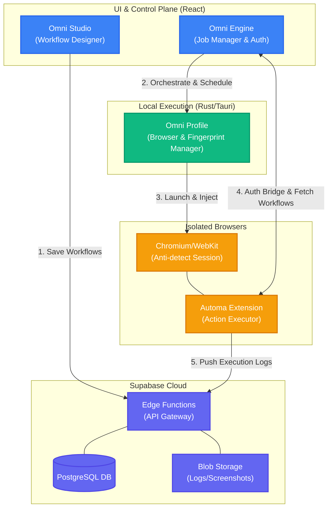
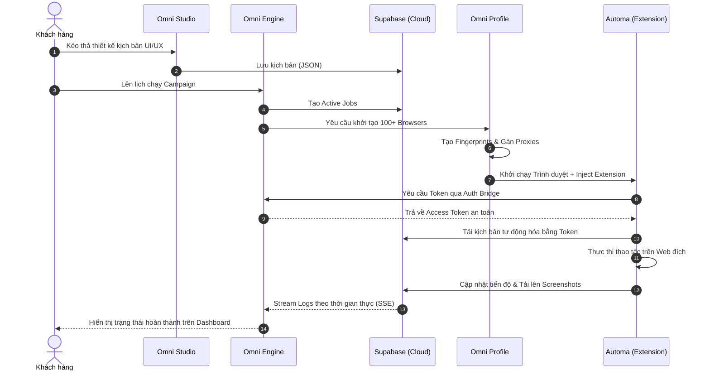

# Kiến trúc Nền tảng OmniDesk (Presale Documentation)

Tài liệu này mô tả chi tiết về cách thức tương tác nghiệp vụ giữa các phân hệ cốt lõi của **OmniDesk**, bao gồm **Profile**, **Studio**, **Engine**, và lõi tự động hóa **Automa (Extension)**. Đây là tài liệu phục vụ mục đích Presale, giúp khách hàng doanh nghiệp hiểu rõ về mức độ bảo mật, khả năng mở rộng và luồng dữ liệu của hệ thống.

## 1. Tổng quan các Phân hệ (Core Components)

| Phân hệ                | Vai trò & Chức năng cốt lõi                                                                                                                                          | Công nghệ nền tảng              |
| :--------------------- | :------------------------------------------------------------------------------------------------------------------------------------------------------------------- | :------------------------------ |
| **Omni Studio**        | Nơi người dùng thiết kế các kịch bản tự động hóa (Workflows) qua giao diện kéo-thả trực quan. Lưu trữ và đồng bộ kịch bản lên Cloud.                                 | React, Dnd-Kit, Supabase        |
| **Omni Engine**        | Trái tim điều phối (Orchestrator). Quản lý hàng đợi (Active Jobs), lịch trình (Cron), và là cầu nối trung chuyển dữ liệu (Auth Bridge) cho Extension.                | React, Edge Functions           |
| **Omni Profile**       | Quản lý môi trường trình duyệt cách ly (Anti-detect browser). Đảm bảo mỗi Profile có Proxy, Fingerprint riêng biệt. Tự động tiêm (inject) Extension vào trình duyệt. | Tauri, Rust Backend, Playwright |
| **Automa (Extension)** | Lõi thực thi (Execution Core) chạy ẩn bên trong các trình duyệt do Profile tạo ra. Tự động nhận lệnh từ Engine và thao tác như người dùng thật.                      | Browser Extension (MV3)         |

---

## 2. Luồng trao đổi Nghiệp vụ (Business Logic Flow)

Quá trình vận hành từ lúc thiết kế kịch bản đến lúc thực thi được khép kín và bảo mật hoàn toàn:

1. **Thiết kế & Lưu trữ (Studio -> Cloud):** Người dùng tạo kịch bản tại Omni Studio. Kịch bản được mã hóa và lưu trữ an toàn tại hệ thống cơ sở dữ liệu trung tâm (Supabase).
2. **Điều phối & Khởi tạo (Engine -> Profile):** Khi đến lịch chạy hoặc có lệnh từ người dùng, Omni Engine sẽ điều phối luồng công việc. Engine gọi Omni Profile để khởi động các môi trường trình duyệt cách ly.
3. **Tiêm lõi Tự động hóa (Profile -> Automa):** Omni Profile khởi động Chromium/WebKit với bộ Fingerprint độc lập và gắn kèm Automa Extension vào bên trong.
4. **Xác thực & Lấy lệnh (Automa <-> Engine):** Thông qua cơ chế **Auth Bridge** tại Engine (`automa.auth`), Automa Extension được cấp quyền truy cập để kéo (fetch) kịch bản từ Cloud về bộ nhớ cục bộ mà không lộ thông tin đăng nhập.
5. **Thực thi & Báo cáo (Automa -> Cloud/Engine):** Automa chạy kịch bản trên các trang web đích. Mọi kết quả, ảnh chụp màn hình (screenshots), và log lỗi đều được đẩy ngược về Supabase và báo cáo trực tiếp trên bảng điều khiển của Engine.

---

## 3. Sơ đồ Kiến trúc & Tương tác (Mermaid)

### Sơ đồ Kiến trúc Tổng thể (Architecture Diagram)

### Biểu đồ Tuần tự Thực thi (Sequence Diagram)

> [!TIP]
> **Điểm nhấn Bán hàng (Unique Selling Points):**
>
> - **Cách ly hoàn toàn:** Mỗi phiên (session) hoạt động trên một Profile độc lập (Proxy, IP, Device Fingerprint riêng), giúp bypass các hệ thống Anti-bot hiệu quả.
> - **Bảo mật tuyệt đối:** Lõi Automa không chứa hard-code credentials. Xác thực được xử lý chéo thông qua cầu nối `automa.auth` của Engine và Supabase Edge Functions.
> - **Khả năng mở rộng (Scalable):** Nhờ tách biệt Engine (điều phối) và Profile (khởi chạy), hệ thống có thể scale lên hàng ngàn tiến trình tự động hóa song song mà vẫn quản lý tập trung trên một Dashboard duy nhất.
