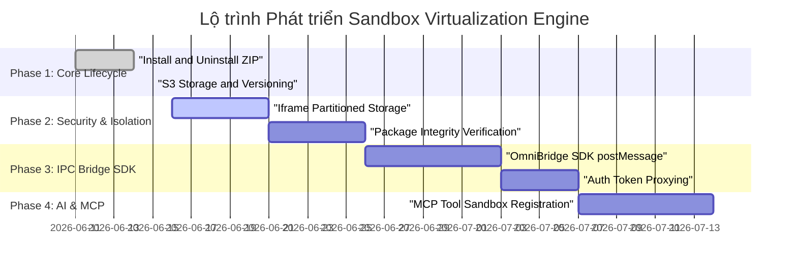

# Technical Roadmap & Feature Backlog: Application Virtualization & Sandbox Engine

Tài liệu này phác họa **Bản đồ tư duy (Mindmap)** và **Lộ trình phát triển (Roadmap/Backlog)** cho hệ thống ảo hóa và cô lập ứng dụng (Application Virtualization & Sandbox Engine) của OmniDesk, phục vụ việc phân phối, vận hành và quản lý các plugin/app bên thứ ba một cách an toàn và tối ưu.

---

## 1. Bản đồ Tư duy Hệ thống (Virtualization Engine Mindmap)

```mermaid
mindmap
  root((OmniDesk Virtualization Engine))
    "Cô lập & Bảo mật (Isolation & Security)"
      "Cô lập File System"
        "Sandbox AppData"
        "Chặn Path Traversal"
      "Cô lập Storage"
        "Cô lập LocalStorage / Cookies"
        "IndexedDB phân vùng"
      "Chính sách CSP"
        "Iframe Sandbox Attribute"
        "Chặn Script độc hại"
      "Ký số Package (Code Signing)"
        "Verify Hash SHA-256"
        "Ký số PKI khóa công khai"
    "Giao tiếp & Tích hợp (IPC & Integration Bridge)"
      "OmniBridge JS SDK"
        "Gọi Tauri Native Commands"
        "Đăng ký Notifications"
      "Quản lý Auth"
        "Token Proxying (JWT sharing)"
        "RBAC UI Wrapper"
      "AI & MCP Integration"
        "Sandbox MCP Tools"
        "AI Agent Context Sharing"
    "Quản lý Vòng đời (Lifecycle Management)"
      "Quản lý Gói (Package Manager)"
        "Tải luồng song song (S3)"
        "Giải nén In-Memory"
      "Cập nhật Động (Hot-Reload)"
        "Background Update"
        "Silent Install / Rollback"
      "Dọn dẹp Tài nguyên"
        "Cache eviction"
        "State migration khi nâng cấp"
    "Phân phối & Vận hành (Enterprise Distribution)"
      "Private Store (B2B Tenant)"
        "Store riêng của doanh nghiệp"
        "Tự deploy S3 riêng"
      "Chỉ số Performance"
        "Giới hạn CPU / RAM Iframe"
        "Lazy loading Iframe"
```

---

## 2. Lộ trình Phát triển & Feature Backlog (Roadmap)

Lộ trình được chia làm 4 giai đoạn phát triển từ Cơ bản đến Chuẩn Enterprise B2B SaaS.



---

## 3. Backlog Feature Chi tiết (User Stories & Tasks)

### Phase 1: Core Lifecycle & Cloud Sync (Hoàn thành)

> [!NOTE]
> Giai đoạn này tập trung vào luồng cài đặt vật lý, phân phối qua đám mây và quản lý phiên bản SQLite cục bộ.

- **[x] VM-101: Local Zip Sandbox Installer**
  - _Mô tả_: Người dùng có thể nhấn Install để giải nén tệp zip ứng dụng vào thư mục cô lập trong AppData và gỡ cài đặt an toàn.
- **[x] VM-102: Supabase S3 Storage Distribution**
  - _Mô tả_: Đưa tệp zip lên Supabase S3. Client tải trực tiếp và giải nén in-memory để tối ưu hóa ghi đĩa.
- **[x] VM-103: Version Checker & Update Trigger**
  - _Mô tả_: So sánh `current_version` (Supabase REST API) với `installed_version` (local SQLite) để hiển thị nút **UPDATE** trên UI.

---

### Phase 2: Cô lập & Bảo mật (Security & Isolation) — _Đang thực hiện_

> [!WARNING]
> Mục tiêu là đảm bảo mã nguồn của bên thứ ba chạy trong Sandbox không thể tấn công host, không thể đọc trộm dữ liệu của app khác và không thể truy cập file system ngoài phạm vi sandbox.

#### [ ] VM-201: Phân vùng dữ liệu duyệt web (Storage Partitioning)

- **Mô tả**: Khi chạy nhiều app khác nhau (ví dụ: `nhaatelier-tattoo` và một app `financial-tracker`), `localStorage`, `sessionStorage` và `cookies` của chúng không được phép dùng chung.
- **Giải pháp**:
  - Sử dụng thẻ `<iframe>` với các thuộc tính sandbox nghiêm ngặt: `sandbox="allow-scripts allow-forms allow-popups"`.
  - Cấu hình phân vùng origin/domain động hoặc sử dụng subdomain ảo (ví dụ: `wordpress-sync.apps.localhost`) thay vì phục vụ chung đường dẫn `localhost:1421/apps/*` để trình duyệt tự động cô lập storage.

#### [ ] VM-202: Ký số và Xác thực tính toàn vẹn (Package Integrity & Code Signing)

- **Mô tả**: Ngăn chặn tấn công Man-in-the-Middle (MitM) chỉnh sửa tệp ZIP trên S3 hoặc đường truyền.
- **Giải pháp**:
  - Khi deploy, tạo mã hash SHA-256 của file zip và lưu vào database `app_versions.package_hash`.
  - Khi client tải zip về, tính toán lại hash SHA-256 cục bộ và đối chiếu với hash từ database trước khi giải nén. Nếu sai lệch, hủy cài đặt lập tức.
  - _Enterprise Option_: Sử dụng chữ ký số PKI (cặp khóa công/tư) để ký số tệp zip khi deploy.

---

### Phase 3: OmniBridge IPC SDK (Giao tiếp an toàn với Máy chủ)

> [!IMPORTANT]
> Các ứng dụng trong sandbox cần gọi các hàm hệ thống (như hiển thị thông báo, mở file picker, lưu cấu hình) hoặc lấy thông tin đăng nhập của user hiện tại mà không được vi phạm bảo mật.

#### [ ] VM-301: OmniBridge JS SDK (Iframe postMessage API)

- **Mô tả**: Cung cấp một thư viện Javascript mỏng (`@omnidesk/bridge-sdk`) cho các ứng dụng nhúng sử dụng.
- **Giải pháp**:
  - Giao tiếp qua `window.parent.postMessage` sử dụng giao thức JSON-RPC 2.0.
  - Host (OmniDesk) lắng nghe sự kiện, xác thực origin của iframe gửi tới, sau đó thực thi Tauri native command tương ứng và trả lại kết quả qua `iframe.contentWindow.postMessage`.
  - _Các APIs cung cấp_: `showNotification()`, `openFileDialog()`, `writeConfig()`, `getSystemTheme()`.

#### [ ] VM-302: Auth Token Proxying

- **Mô tả**: Hỗ trợ ứng dụng sandbox tự động gọi API của riêng nó (hoặc API của OmniDesk) bằng cách kế thừa phiên đăng nhập của người dùng.
- **Giải pháp**:
  - App sandbox gửi request qua OmniBridge: `OmniBridge.getAccessToken()`.
  - OmniDesk verify quyền truy cập của app, lấy JWT token hiện tại của user và trả về cho app nhúng.

---

### Phase 4: Trợ lý AI & MCP Sandbox Integration (AI-Ready Sandbox)

> [!TIP]
> Tích hợp sandbox với AI Assistant của OmniDesk, cho phép AI đọc hiểu dữ liệu của app sandbox và ra lệnh cho app thực hiện công việc thay cho user.

#### [ ] VM-401: MCP Tools Sandbox Registration

- **Mô tả**: Ứng dụng ảo hóa có thể cung cấp các "Tools" và "Resources" cho AI Assistant thông qua giao thức Model Context Protocol (MCP).
- **Giải pháp**:
  - App sandbox khai báo một file cấu hình `mcp-manifest.json` trong gói zip.
  - Khi cài đặt app, OmniDesk đọc file này và tự động đăng ký các tools (ví dụ: tool `sync_wordpress_content`) vào MCP Gateway của host.
  - Khi AI Assistant gọi tool này, host sẽ chuyển tiếp (dispatch) action tới Iframe của app thông qua OmniBridge để xử lý.
